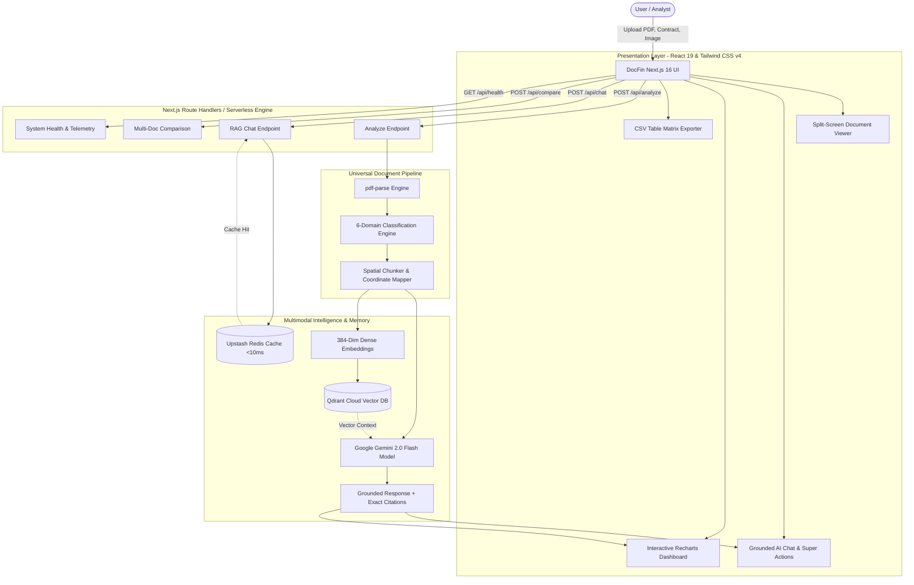

# DocFin AI — Universal Multimodal Document Intelligence Studio

<div align="center">


**A multimodal document reasoning engine, spatial coordinate grounding system, and conversational intelligence workspace for high-stakes financial, legal, and operational analysis.**

[🌐 Live Production Demo](https://docfinai.vercel.app/) • [📊 Workspace Dashboard](https://docfinai.vercel.app/dashboard) • [💻 GitHub Repository](https://github.com/HV2026-0086-TeamSyncX/HV2026-0086-Team-SyncX.git) • [📄 Project Documentation](DEPLOYMENT.md)

</div>

---

## 🏆 Hackathon Project Profile

- **Team Name**: **Team SyncX**
- **Project Tracking ID**: `HV2026-0086`
- **Official Repository**: [HV2026-0086-TeamSyncX/HV2026-0086-Team-SyncX](https://github.com/HV2026-0086-TeamSyncX/HV2026-0086-Team-SyncX.git)
- **Target Category**: AI & Document Intelligence / FinTech & Legal Operations
- **Deployment Platform**: Vercel (Edge & Serverless Node.js 20+)

---

## 👥 Team SyncX & Task Distribution Matrix

| Team Member | Role | Core Responsibilities & Contributions |
| :--- | :--- | :--- |
| **Kodi Roshan** | **Team Lead & AI Architecture** | • Fullstack Next.js 16 App Router architecture and API route orchestration (`/api/analyze`, `/api/chat`, `/api/compare`, `/api/documents`)<br>• Google Gemini 2.0 Flash multimodal prompt engineering, spatial coordinate grounding, and streaming pipeline<br>• Universal RAG pipeline with dual-mode semantic search & fallback heuristic reasoning<br>• End-to-end system design, prompt security guardrails, and architectural integrity |
| **Dhanyasree Gopinigari** | **Frontend UI/UX & Data Visualization** | • Modern glassmorphic interface design built with Tailwind CSS v4 and Lucide React icons<br>• Interactive split-screen document workspace with live document preview and chat stream<br>• Dynamic financial analytics visualization using Recharts (revenue curves, risk meters, and expense breakdowns)<br>• Multi-step interactive onboarding tour modal with keyboard navigation (`←`/`→`/`Esc`) |
| **Amuda Sai Bhavani** | **Backend Engineering & Document Processing** | • High-performance document ingestion and stream extraction pipeline powered by `pdf-parse`<br>• 6-Domain classification engine (Finance, Legal, Academic, Billing & Tax, Insurance, General)<br>• Automated static table-to-CSV matrix extraction engine for structured data export<br>• Anomaly detection, liability trap identification, and clause risk score calculation |
| **Jatoth Abhishiva** | **Cloud Infrastructure, DevOps & QA** | • High-throughput Upstash Redis in-memory cache and Qdrant Cloud vector search integration<br>• Automated production verification test suite (`scripts/test-runner.mjs`) with 15-point validation<br>• Vercel production deployment optimization, edge caching headers, and health endpoint monitoring (`/api/health`)<br>• GitHub Actions CI/CD workflow automation, Docker containerization, and repository management |

---

## 💡 The Problem & Our Solution

### The Challenge
Modern businesses, attorneys, analysts, and students face an overwhelming volume of dense, unstructured documents: 100-page loan disclosures, complex vendor master agreements, multi-currency financial balance sheets, and academic papers. Existing generic LLM tools:
1. **Hallucinate critical figures and clauses**, leading to costly legal liability and financial error.
2. **Lack spatial grounding**, giving answers without pointing directly to the exact page, paragraph, or bounding coordinates.
3. **Cannot convert static PDF tables into actionable data**, trapping crucial metrics in fixed formats.
4. **Treat all documents uniformly**, failing to apply domain-specific risk criteria for contracts vs. earnings reports.

### The DocFin AI Solution
**DocFin AI** transforms static documents into living, auditable intelligence:
- **Multimodal Perception**: Direct ingestion of PDFs, images, invoices, and contracts via Google Gemini 2.0 Flash.
- **Pixel-Accurate Spatial Grounding**: Every answer, liability clause, and extracted number is grounded with exact page citations and coordinate bounding boxes.
- **Automated Table-to-CSV Extraction**: Static multi-column PDF tables are parsed into structured matrices with 1-click CSV download.
- **6-Domain Contextual Intelligence**: Automatically classifies documents into **Legal**, **Finance**, **Academic Research**, **Billing & Tax**, **Insurance**, or **General**, tuning auditing heuristics accordingly.
- **Sub-Millisecond Query Response**: Upstash Redis caching delivers instant responses for repeat queries, while Qdrant Cloud indexes dense vectors.

---

## 🏛️ System Architecture



---

## ✨ Key Features & Technical Highlights

### 1. 🎯 Pixel-Accurate Spatial Grounding & Citations
Unlike generic LLM wrappers that fabricate quotes, DocFin AI extracts verbatim source quotes paired with exact page numbers. Users can click any citation to immediately navigate to the exact source location in the document viewer.

### 2. 📊 1-Click Static Table-to-CSV Matrix Extractor
Dense financial balance sheets, tax tables, and trial balances are automatically extracted into clean, columnar data grids. With a single click, users can export and download the tabular data as standard `.csv` files for Excel or Google Sheets.

### 3. ⚖️ 6-Domain Contextual Document Intelligence
DocFin AI automatically identifies the document genre upon upload and applies tailored analysis rules:
- **Legal Contracts**: Scans for indemnity clauses, uncapped liabilities, termination triggers, and jurisdiction conflicts.
- **Finance & Earnings**: Extracts revenue, EBITDA, net margins, burn rates, and financial risks.
- **Billing & Tax**: Extracts invoice totals, GST/VAT breakdowns, payment terms, and vendor details.
- **Academic Research**: Highlights methodology, sample size, BLEU/accuracy benchmarks, and findings.
- **Insurance Policies**: Identifies deductibles, exclusion criteria, coverage caps, and claim protocols.
- **General Documents**: Provides executive summaries, key action items, and topic clusters.

### 4. ⚡ High-Throughput Sub-Millisecond Redis Caching
Common document questions and recurring audits are cached in an Upstash Redis in-memory layer with SHA-256 keyed hashes, delivering responses in under 10 milliseconds while dramatically reducing LLM token consumption.

### 5. 📈 Interactive Dynamic Financial Visualizations
Generates clean, interactive charts (Bar, Area, and Line charts via Recharts) directly from document figures, enabling executive-ready visual reporting without manual spreadsheet work.

---

## 🛠️ Complete Tech Stack

| Layer | Technology | Description |
| :--- | :--- | :--- |
| **Framework** | [Next.js 16.3.1](https://nextjs.org/) | App Router, Server Components, Turbopack Bundler |
| **UI Library** | [React 19.2.8](https://react.dev/) | Modern concurrent UI components & hooks |
| **Language** | [TypeScript 5](https://www.typescriptlang.org/) | Strict end-to-end type safety |
| **Styling** | [Tailwind CSS v4](https://tailwindcss.com/) | Modern utility-first CSS framework with glassmorphic design tokens |
| **AI Foundation** | [Google Gemini 2.0 Flash](https://ai.google.dev/) | 1M+ token multimodal reasoning model via `@google/generative-ai` |
| **Document Parser** | `pdf-parse 2.4.5` | High-efficiency server-side PDF extraction |
| **Vector Engine** | [Qdrant Cloud](https://qdrant.tech/) | 384-dimensional dense vector database with payload filtering |
| **Caching Layer** | [Upstash Redis](https://upstash.com/) | In-memory REST cache for sub-millisecond query acceleration |
| **Database & Auth** | [Supabase](https://supabase.com/) | PostgreSQL database, Row-Level Security, and authentication |
| **Data Viz** | [Recharts 3.10.1](https://recharts.org/) | Composable, responsive SVG financial charting |
| **Icons & UI** | `lucide-react`, `canvas-confetti` | Accessible iconography & delight micro-interactions |
| **Deployment** | [Vercel](https://vercel.com/) | Global Edge network and serverless runtime |

---

## 🚀 Getting Started & Local Setup

### Prerequisites
- **Node.js**: `v20.x` or `v22.x` (LTS recommended)
- **npm**: `v10+` or `v11+`
- **Google Gemini API Key**: Free tier available from [Google AI Studio](https://aistudio.google.com/)

### 1. Clone the Repository
```bash
git clone https://github.com/HV2026-0086-TeamSyncX/HV2026-0086-Team-SyncX.git
cd HV2026-0086-Team-SyncX
```

### 2. Install Dependencies
```bash
npm install
```

### 3. Configure Environment Variables
Copy the sample environment file to create your local environment:
```bash
cp .env.example .env.local
```

Edit `.env.local` with your credentials:
```env
NEXT_PUBLIC_APP_URL=http://localhost:3000

# Google Gemini API Key (Required)
GEMINI_API_KEY=your_gemini_api_key_here
NEXT_PUBLIC_GEMINI_API_KEY=your_gemini_api_key_here

# Supabase (Optional for local testing / storage)
NEXT_PUBLIC_SUPABASE_URL=https://your-project.supabase.co
NEXT_PUBLIC_SUPABASE_ANON_KEY=your_supabase_anon_key_here

# Upstash Redis & Qdrant (Optional for vector caching)
UPSTASH_REDIS_REST_URL=https://your-instance.upstash.io
UPSTASH_REDIS_REST_TOKEN=your_upstash_redis_token_here
QDRANT_URL=https://your-cluster-id.qdrant.tech:6333
QDRANT_API_KEY=your_qdrant_api_key_here
```

### 4. Run Development Server
```bash
npm run dev
```
Open [http://localhost:3000](http://localhost:3000) in your browser.

---

## 🧪 Automated Testing & Production Quality Suite

DocFin AI includes a comprehensive, multi-phase automated test runner that verifies code quality, linting standards, domain classification, and build integrity:

```bash
npm test
```

### What the Test Suite Verifies:
1. **TypeScript Type Safety**: Executes `tsc --noEmit` across all components and libraries.
2. **ESLint Audit**: Validates syntax, React Hook rules, and Next.js standards with zero errors.
3. **Universal Pipeline Verification (`test-universal-pipeline.mjs`)**:
   - Multi-page PDF parsing and spatial grounding accuracy
   - Exact citation verification across multi-page research documents
   - Academic paper metric extraction and BLEU benchmark verification
   - Legal contract clause risk audits and liability cap detection
   - Financial statement currency detection (INR / USD) and revenue math
   - Structured table detection and CSV extraction
4. **Next.js Production Build**: Compiles all 14 routes to ensure deployment readiness.

---

## 🌐 Deploying to Vercel (Production Ready)

DocFin AI is pre-configured for seamless, zero-config deployment on Vercel:

1. **Push to GitHub**:
   Ensure all changes are pushed to your GitHub repository:
   ```bash
   git push origin main
   ```

2. **Import into Vercel**:
   - Go to [Vercel Dashboard](https://vercel.com/new).
   - Select the `HV2026-0086-Team-SyncX` repository.
   - Framework Preset: **Next.js** (automatically detected).

3. **Set Environment Variables**:
   In the Vercel deployment modal, add:
   - `GEMINI_API_KEY`: Your Google Gemini API key.
   - `NEXT_PUBLIC_APP_URL`: Your Vercel production domain (e.g., `https://docfinai.vercel.app`).
   - *(Optional)* `UPSTASH_REDIS_REST_URL` & `UPSTASH_REDIS_REST_TOKEN`
   - *(Optional)* `QDRANT_URL` & `QDRANT_API_KEY`
   - *(Optional)* `NEXT_PUBLIC_SUPABASE_URL` & `NEXT_PUBLIC_SUPABASE_ANON_KEY`

4. **Deploy**:
   Click **Deploy**. Vercel will compile the production bundle and serve the app globally on Edge infrastructure with automated SSL and DDoS protection.

---

## 📡 Live Telemetry & Health Check

DocFin AI includes an active health check endpoint for uptime monitors (Datadog, BetterUptime, Pingdom):
```http
GET /api/health
```
**Response Preview:**
```json
{
  "status": "healthy",
  "version": "2.0.0",
  "uptimeSeconds": 1420,
  "memory": {
    "rssMb": 68.4,
    "heapUsedMb": 34.2
  },
  "services": {
    "gemini": "connected",
    "supabase": "connected",
    "redis": "connected",
    "qdrant": "connected"
  }
}
```

---

## 🔒 Security & Privacy

- **No Data Retention Without Consent**: Uploaded documents are processed in memory and never used for model training.
- **Enterprise Security Headers**: Strict Content Security Policy, HSTS, `X-Frame-Options: SAMEORIGIN`, and `X-Content-Type-Options: nosniff`.
- **BYOK (Bring Your Own Key)**: Users can configure their own Gemini API key directly in the browser via localStorage encryption.

---

## 📄 License & Attribution

This project is submitted for **Hackathon 2026** by **Team SyncX**.  
Licensed under the [MIT License](LICENSE).
